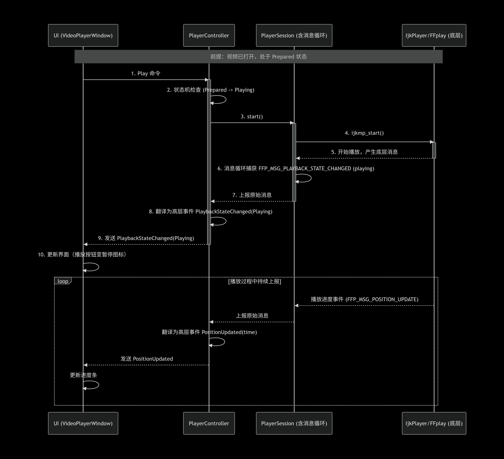

我的“事件流”核心思想只有一句话：

UI 不直接消费播放器底层消息，UI 只消费“被翻译过的播放器事件”。

这件事对长期维护特别重要。

1. 先说为什么要做事件流
你现在的 HomeWindow::message_loop() 本质上已经是事件流雏形了，只是它还比较“底层直出”：

收到 FFP_MSG_PREPARED
收到 FFP_MSG_SEEK_COMPLETE
收到 FFP_MSG_PLAYBACK_STATE_CHANGED
收到 FFP_MSG_PLAY_FINISH
这些消息本身没问题，但它们属于播放器内核语言，不是UI 语言。

长期维护时，最好加一层“翻译”：

底层消息：FFP_MSG_PREPARED

高层事件：MediaPrepared

底层消息：FFP_MSG_PLAYBACK_STATE_CHANGED

高层事件：PlaybackStateChanged(Playing/Paused/Stopped)

底层消息：FFP_MSG_SEEK_COMPLETE

高层事件：SeekCompleted

这样 UI 永远只关心高层事件，不关心 IJK/FFplay 的内部细节。

2. 我这套事件流分三层
我会把流转拆成三层：

第一层：命令流
UI -> PlayerController

比如：

OpenMedia(videoId/url)
Play
Pause
Stop
Seek(position)
SetVolume(value)
SetRate(rate)
这层表达的是：

“我希望播放器做什么”

第二层：内核消息流
PlayerEngine / IjkPlayer / FFplay 内部

比如：

FFP_MSG_PREPARED
FFP_MSG_SEEK_COMPLETE
FFP_MSG_ERROR
FFP_MSG_PLAYBACK_STATE_CHANGED
FFP_MSG_VIDEO_RENDERING_START
这层表达的是：

“播放器底层现在发生了什么”

这层不要直接暴露给 UI。

第三层：高层事件流
PlayerController -> UI

比如：

Prepared
FirstFrameReady
StateChanged
PositionUpdated
DurationKnown
BufferingStarted
BufferingEnded
SeekCompleted
PlaybackFinished
ErrorOccurred
这层表达的是：

“UI 现在应该知道什么”

3. 为什么这比直接 message_loop 更适合扩展
因为它把“消息”分成了两种完全不同的东西：

命令
是 UI 发出去的，方向单向：

我要播放
我要暂停
我要拖动
事件
是播放器回来的，方向单向：

我已经准备好了
我已经暂停了
我现在播放到 12.3 秒
我出错了
这个分离特别值钱，因为一旦命令和事件混在一起，后面会很容易出现：

UI 改状态，播放器也改状态
两边都在控制播放按钮文本
seek 完成前 UI 先乱跳
pause 和 buffering 互相覆盖
而分开后，规则很清晰：

UI 只能发命令
PlayerEngine 只能发事件
真正状态以 PlayerController 为准
4. 这套事件流里最关键的角色是谁
不是 VideoPlayerWindow，也不是 message_loop 本身。

最关键的是 PlayerController。

它做 4 件事：

接收 UI 命令
调用底层播放器
把底层消息翻译成高层事件
维护统一播放状态
你可以把它理解成“播放器协调层”。

它的位置正好介于：

上面：窗口/UI
下面：IjkPlayer/FFplay/FFmpeg
所以它是隔离复杂度的关键。

5. 我建议的状态机
事件流如果没有状态机，后面还是会乱。

我建议至少有这些状态：

Idle
Opening
Prepared
Playing
Paused
Seeking
Buffering
Stopped
Completed
Error
每个事件进来时，不是直接“想怎么处理就怎么处理”，而是：

事件 + 当前状态 -> 新状态 + 副作用

例如：

OpenMedia

Idle -> Opening
收到底层 prepared

Opening -> Prepared
用户点播放

Prepared -> Playing
用户点暂停

Playing -> Paused
用户拖动进度

Playing/Paused -> Seeking
收到底层 seek complete

Seeking -> Paused 或 Playing
取决于拖动前状态
这套状态机是事件流稳定的基础。

6. 你最关心的 message_loop 在我这套里怎么放
它不是消失，而是“换位置”。

你现在是：

HomeWindow::message_loop()
我建议长期演进成：

PlayerSession::messageLoop()
或 PlayerEngine::messageLoop()
也就是：

窗口不再拥有底层消息循环
播放会话拥有自己的消息循环
控制器订阅这个会话的事件，再转给 UI
这样好处很大：

窗口销毁不等于消息循环逻辑混乱
一个窗口可切多个视频，但会话生命周期更独立
后面支持多实例播放器也更自然
7. 这套事件流的完整链路
拿“点击首页卡片并播放”举例：

用户点击 VideoCard
MainWindow 打开 VideoPlayerWindow
VideoPlayerWindow 发命令：OpenMedia(video)
PlayerController 创建或复用 PlayerSession
PlayerSession 驱动底层 IjkPlayer/FFplay
底层消息循环收到 prepared
PlayerSession 翻译成高层事件 Prepared
PlayerController 更新状态并通知 UI
UI 更新按钮、标题、时长
如果策略是自动播放，再发 Play
底层进入播放
持续回推：
FirstFrameReady
PositionUpdated
BufferingStarted/Ended
PlaybackFinished
这里最关键的是：

UI 从头到尾不直接看 FFP_MSG_*。

8. 为什么这特别适合长期维护
因为后面你加功能时，几乎都能挂到事件流上，而不是到处加 if。

比如要加：

首帧加载动画
缓冲圈
拖动进度条
自动连播
倍速播放
截图成功提示
播放结束推荐下一条
网络错误重试
都可以自然落在：

命令
事件
状态机
这三件东西上。

所以扩展时不是“改一堆窗口代码”，而是：

新增一个命令
新增一个事件
补一段状态转换
这就是长期维护舒服的地方。

9. 它和你现在架构的衔接点
你不需要一下全推翻。

你现有代码里最适合演进的点就是这个：

message_loop() 保留
但不再属于 HomeWindow
它改成播放器层内部循环
把 FFP_MSG_* 翻译成高层事件
UI 改为订阅高层事件
可以说：

你的现有架构已经有事件流了，只是还没“抽象成可维护的事件流”。

10. 一句总结
我的事件流独到之处，不是“用了消息”，而是：

把底层播放器消息，变成了上层业务事件。

这样 UI、播放器内核、状态管理三者不会纠缠在一起。

如果你愿意，我下一步可以继续只讲架构，专门给你列一份：

“播放器命令清单”
“播放器事件清单”
“状态机转移表”
这三张表一出来，你整个播放器骨架就会非常清楚。

1. showEmptyState() 要不要改成 showSelectedVideo()
不建议直接删掉 showEmptyState()。

更合理的思路是：

VideoPlayerWindow 作为一个播放器容器，本身要有“空状态”
但在你的业务里，这个窗口通常是“用户点了卡片之后才创建”
所以第一次真正打开窗口时，可以立刻走：
创建窗口 -> showSelectedVideo(...) -> show()
也就是说：

showEmptyState() 仍然保留，表示“还没有选中视频 / 资源释放后 / 出错后”
用户第一次点击卡片时，不展示空态，而是直接进入“已选中视频”态
所以从交互上看，第一次打开时确实更像直接进入 showSelectedVideo(...)，但架构上空态仍然有价值。

2. playButton_ 点击后应该做什么
按钮不应该直接负责“渲染帧”，它只负责发播放意图。

更好的播放器状态机是：

Idle：还没绑定视频
Loading：正在打开媒体、初始化解码
Ready：资源准备好了，但还没播
Playing：正在播放
Paused：暂停
Stopped：停止
Error：播放失败
那么按钮行为可以这样理解：

当前是 Idle/Stopped：执行“打开并开始播放”
当前是 Ready/Paused：执行“恢复播放”
当前是 Playing：执行“暂停播放”
关键点是：

playButton_ 只发命令
真正的解码、时钟推进、帧渲染，不由按钮驱动
按钮只是切状态，不是帧循环入口
3. 画面帧渲染应该放在哪
渲染链最好独立于窗口按钮逻辑。

可以拆成这几个角色：

VideoPlayerWindow
负责 UI、按钮、标题、进度条、承载视频画面的区域

PlayerController
负责接收 UI 命令，比如 open/play/pause/seek/stop

PlayerSession 或 PlayerEngine
负责一次具体播放任务的生命周期

Decoder
负责解封装、解码音视频帧

Renderer
负责把视频帧送到 UI 画面区域，把音频帧送到音频输出

也就是说：

VideoPlayerWindow 不直接“渲染帧”
它只是持有一个视频显示载体
真正的帧推进在播放器引擎里持续运行
``那么我的播放器实例在哪里接收呢？``

现在还没有地方真正“接收播放器实例”。当前链路只传了视频元数据，没有传播放器对象：

首页发信号在 HomePage.cpp (line 116)
主窗口接线并弹出窗口在 MainWindow.cpp (line 126)
播放窗口目前只接收 videoId/title/creator/duration，在 VideoPlayerWindow.cpp (line 16)
如果按现在这套职责划分，播放器实例应该接在 VideoPlayerWindow，不是 HomePage，也不是 StreamPage。

推荐接法是这样：

在启动装配层创建播放器相关对象
例如在 ``AppBootstrap`` 里创建 PlayerController / PlayerService / QMediaPlayer 封装。

把它注入给 MainWindow
就像现在注入 AuthController 一样。

MainWindow 在首次创建 VideoPlayerWindow 时，把播放器实例或播放器控制器传进去
也就是把现在的：
videoPlayerWindow_ = new VideoPlayerWindow();
改成类似：
videoPlayerWindow_ = new VideoPlayerWindow(playerController_);

``VideoPlayerWindow 内部持有这个播放器实例，并把画面挂到自己的播放区域上``
也就是左侧那个 playerSurface_ 位置。

最关键的一句是：
MainWindow 负责“把窗口打开”，VideoPlayerWindow 负责“真正接住并使用播放器实例”。