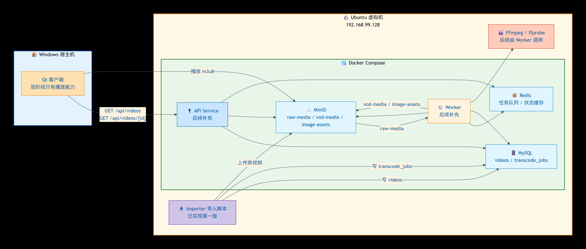

# 点播方案

## 1. 文档目的

这份文档不是再讲一遍“点播系统有哪些模块”，而是给出一套适合当前项目的、可以在一台虚拟机上先跑起来的点播落地方案。

当前已知前提：

- 你已经有播放器，客户端已经具备播放能力。
- 你当前的程序还没有上传能力，现阶段只有播放能力。
- 当前仓库的 `frontend` / `app` / `backend` 更像桌面端应用分层，不是现成的 HTTP 服务端。
- 这次目标要分两步走：先把“入库 -> 转码 -> 播放”跑通，再补“客户端上传”。

文档默认目标：

- 第一阶段只做点播，不做直播。
- 第一阶段不做复杂推荐、搜索、评论、弹幕。
- 第一阶段优先做单机可运行原型，再考虑扩容。

---

## 2. 先定边界

### 2.1 第一阶段一定要做的

- 服务端能导入视频文件
- 异步转码为 HLS
- 生成封面和基础元数据
- 数据库存储视频记录和播放地址
- 客户端请求视频列表并播放

### 2.2 第一阶段不要一上来就做的

- 多机分布式部署
- 多码率自适应转码的全套能力
- 复杂审核流
- CDN、DRM、强版权保护
- Elasticsearch 搜索
- 推荐算法

### 2.3 为什么这样收敛

因为你现在最缺的不是“技术名词”，而是一个最小可行闭环。

只要下面这条链路能通，播放器就真正接上了服务端：

1. 服务端先把视频导入系统
2. Worker 转码产出 `.m3u8 + .ts`
3. API 返回视频详情
4. 客户端拿到播放地址
5. 播放器播放 HLS

---

## 3. 结论先说

对你现在这个阶段，我建议直接采用下面这套单机方案：

- 一台 Ubuntu 22.04 虚拟机
- `Nginx` 作为统一入口
- 一个 `API 服务` 负责业务接口
- 一个 `Worker 服务` 负责转码和截图
- `MySQL` 存元数据
- `Redis` 做任务队列和状态缓存
- `MinIO` 存原视频、切片、封面

这是一个可行方案，因为：

- 部署简单，全部可以容器化
- 结构清楚，后续能横向扩展
- 对现有客户端改动集中在“视频列表 / 视频详情 / 播放地址请求”
- 视频处理和业务 API 解耦，不会把上传接口卡死

---

## 4. 推荐架构

### 4.1 当前第一阶段架构图

+----------------------------------------------------------------------+
| Windows 宿主机                                                       |
|                                                                     |
|  ┌─────────────────┐                                                |
|  │   Qt 客户端     │                                                |
|  │ (播放能力)      │                                                |
|  └─────────────────┘                                                |
|         │                              │                            |
|         │ GET /api/videos...           │ 播放 m3u8                  |
|         │                              │                            |
|         v                              v                            |
+---------│------------------------------│----------------------------+
          │                              │
          │   ┌──────────────────────────┼────────────────────────┐
          │   │ Ubuntu 虚拟机 (192.168.99.128)                    │
          │   │                                                  │
          │   │  ┌────────────────────────────────────────────┐  │
          │   │  │ Docker Compose                            │  │
          │   │  │                                            │  │
          │   │  │  ┌────────┐  ┌────────┐  ┌────────────┐  │  │
          │   │  │  │ MySQL  │  │ Redis  │  │   MinIO    │  │  │
          │   │  │  │ videos │  │ 队列/  │  │ raw-media  │  │  │
          │   │  │  │ trans- │  │ 缓存   │  │ vod-media  │  │  │
          │   │  │  │ code   │  │        │  │ image-     │  │  │
          │   │  │  └────────┘  └────────┘  │ assets     │  │  │
          │   │  │                           └────────────┘  │  │
          │   │  │  ┌────────┐  ┌────────┐                  │  │
          │   │  │  │  API   │  │ Worker │                  │  │
          │   │  │  │(后续)  │  │(后续)  │                  │  │
          │   │  │  └────────┘  └────────┘                  │  │
          │   │  └────────────────────────────────────────────┘  │
          │   │                                                  │
          │   │  ┌─────────────────┐  ┌─────────────────┐       │
          │   │  │   Importer      │  │     FFmpeg      │       │
          │   │  │  (已实现)       │  │   (后续调用)    │       │
          │   │  └─────────────────┘  └─────────────────┘       │
          │   └──────────────────────────────────────────────────┘
          │                              ▲
          └──────────────────────────────┘
                       (上传原视频)

数据流说明：
• Qt → API：GET /api/videos...
• Qt → MinIO：直接播放 m3u8 文件
• Importer → MySQL：写入 videos、transcode_jobs
• Importer → MinIO：上传原始视频文件到 raw-media
• API ↔ MySQL / MinIO / Redis：提供 REST 接口
• Worker ↔ Redis / MySQL / MinIO：消费任务、转码、更新状态
• MinIO (raw-media) → Worker：读取原始视频
• Worker → MinIO (vod-media / image-assets)：写入转码结果与截图
这张图对应你当前已经确定的方向：

- Qt 客户端继续留在 Windows 上
- 所有服务端基础设施都先放在 Ubuntu 虚拟机里
- 当前先做“导入 -> 转码 -> 播放”闭环
- 当前已落地到代码的是 `Importer 导入脚本`
- `API Service` 和 `Worker` 是下一阶段继续补齐的部分

### 4.2 逻辑架构说明

```text
Qt 客户端
  ├─ 首页/详情页：请求视频列表、详情
  └─ 播放器：播放 m3u8 地址

                |
                v

             Nginx
      ├─ /api/*  -> API Service
      └─ /vod/*  -> MinIO 或 MinIO 代理地址

                |
                v

           API Service
      ├─ 用户鉴权
      ├─ 视频导入接口或后台导入任务
      ├─ 视频元数据管理
      ├─ 播放地址生成
      └─ 投递转码任务到 Redis

                |
                v

           Redis Queue

                |
                v

           Worker Service
      ├─ 拉取任务
      ├─ 下载原视频
      ├─ ffprobe 提取元数据
      ├─ ffmpeg 转码 HLS
      ├─ 生成封面
      ├─ 上传产物到 MinIO
      └─ 更新 MySQL 状态

                |
        -----------------
        |               |
        v               v
      MySQL           MinIO
```

---

## 5. 为什么建议服务端单独做，不塞回当前桌面端 `backend`

当前仓库里的 `backend` 更像桌面应用内部业务层，负责控制器、业务对象、播放器相关能力，不是面向虚拟机部署的 Web 服务。

所以更合理的做法是：

- 保留当前桌面端工程继续做客户端
- 新建一个独立服务端目录，比如 `server/`
- 让 Qt 客户端通过 HTTP 调这个服务端

这样做的好处：

- 职责清楚
- 客户端和服务端发布节奏独立
- 后续如果要换成 Web/App 客户端，也能复用服务端接口

如果把 HTTP 服务、转码任务、数据库访问继续塞进当前桌面端 `backend`，后面会越来越难维护。

---

## 6. 第一版技术选型

这一段我不再给你三四套可选项，而是直接给一套建议。

### 6.1 推荐组合

- API 服务：`Go + Gin`
- Worker：`Go`
- 数据库：`MySQL 8`
- 队列：`Redis`
- 对象存储：`MinIO`
- 反向代理：`Nginx`
- 转码工具：`FFmpeg + ffprobe`
- 部署方式：`Docker Compose`

### 6.2 为什么这样选

- Go 做 HTTP 服务和任务 Worker 都比较稳，单文件部署也方便。
- Redis 在第一阶段足够用，先不引入 RabbitMQ/Kafka。
- MinIO 对象存储接口接近 S3，后续迁移 OSS/COS/S3 比较顺。
- Docker Compose 对单机虚拟机非常合适，维护成本低。

### 6.3 如果你不想上 Go

也可以用 `Node.js + Express/NestJS`，但文档后面默认按“API 服务 + Worker + Redis + MinIO”这套结构理解，核心不是语言，而是拆分方式。

---

## 7. 虚拟机规格建议

### 7.1 最低可跑配置

- 4 vCPU
- 8 GB RAM
- 100 GB SSD
- Ubuntu 22.04 LTS

这个配置能跑通原型，但转码速度不会太快。

### 7.2 更稳妥的配置

- 8 vCPU
- 16 GB RAM
- 200 GB SSD

如果你要频繁上传 1080p 视频，建议直接从这个档位起步。

### 7.3 资源压力主要在哪里

- 最吃 CPU：FFmpeg 转码
- 最吃磁盘：原视频 + HLS 切片
- 最吃带宽：视频播放下载

所以单机瓶颈通常不是 API，而是转码和存储。

---

## 8. 第一版到底做到什么程度最合适

### 8.0 先区分两个阶段

你当前程序只有播放，没有上传，所以建议把点播拆成两个阶段：

- 阶段 A：播放优先
  服务端先把视频准备好，客户端只负责拉列表、取详情、播放 HLS。
- 阶段 B：上传补齐
  等播放闭环稳定后，再在客户端或管理后台补上传入口。

对你现在最合适的是先做阶段 A。

### 8.1 强烈建议：先做单码率 HLS

第一版不要直接做 360p/480p/720p/1080p 多档自适应。

建议只做一套播放产物：

- 输出格式：HLS
- 清晰度：720p 上限
- 音频：AAC

具体策略：

- 如果原视频小于等于 720p，就保持原分辨率附近输出
- 如果原视频高于 720p，就压到 720p

### 8.2 为什么不是直接 MP4

直接播 MP4 的实现最简单，但长期不划算：

- 拖动体验不如 HLS
- 后续做 CDN、切片缓存、限速、分段加载都更别扭
- 你既然已经有播放器，最好第一版就让它吃 HLS

### 8.3 为什么不是一上来多码率

因为多码率会立刻增加：

- 转码耗时
- 存储空间
- 状态管理复杂度
- 播放地址组织复杂度

第一阶段最重要的是先把播放链路跑通。

---

## 9. 服务划分

### 9.1 API Service

职责：

- 用户登录鉴权
- 提供视频导入能力
- 创建视频记录
- 投递转码任务
- 返回列表、详情、播放地址

不负责：

- 真正转码
- 长时间阻塞等待 FFmpeg

### 9.2 Worker Service

职责：

- 消费转码任务
- 调用 `ffprobe`
- 调用 `ffmpeg`
- 上传封面和切片
- 更新视频状态

### 9.3 MySQL

至少存这些内容：

- 用户
- 视频主表
- 转码任务表
- 可选的播放地址表或清晰度表

### 9.4 Redis

第一阶段用途：

- 任务队列
- 去重锁
- 任务重试计数
- 短时缓存

### 9.5 MinIO

第一阶段用途：

- 存原视频
- 存 HLS 切片
- 存封面

### 9.6 视频导入方式

既然当前客户端没有上传，第一阶段建议从下面三种方式里选一种：

- 方式 1：服务端本地脚本导入
  直接在虚拟机上执行导入命令，把本地视频入库并投递转码任务。
- 方式 2：简单管理后台导入
  单独做一个给管理员使用的 Web 页面上传视频。
- 方式 3：临时接口导入
  保留一个管理用 HTTP 上传接口，但不给当前 Qt 客户端接入。

如果目标是最快跑通，优先选“服务端本地脚本导入”。

---

## 10. 存储规划

建议至少分三个 bucket：

- `raw-media`
- `vod-media`
- `image-assets`

### 10.1 `raw-media`

用途：

- 原始上传文件
- 只给服务端和 Worker 访问

路径建议：

```text
raw-media/
  video/{video_id}/source/original.mp4
```

### 10.2 `vod-media`

用途：

- HLS 产物
- 可通过 Nginx 对外提供访问

路径建议：

```text
vod-media/
  video/{video_id}/hls/
    index.m3u8
    seg_000.ts
    seg_001.ts
```

### 10.3 `image-assets`

用途：

- 封面图

路径建议：

```text
image-assets/
  video/{video_id}/cover.jpg
```

### 10.4 为什么要这样分桶

- 权限更清楚
- 生命周期更容易管理
- 原视频和播放产物分离，后续清理更方便

---

## 11. 数据库设计建议

第一版不需要非常复杂，但至少要能支撑状态流转。

### 11.1 `videos`

建议字段：

```text
id
user_id
title
description
source_object_key
cover_object_key
play_object_key
status
duration_ms
width
height
file_size
mime_type
transcode_error
created_at
updated_at
published_at
```

`status` 建议枚举：

- `uploaded`
- `queued`
- `processing`
- `ready`
- `failed`

### 11.2 `transcode_jobs`

建议字段：

```text
id
video_id
job_type
status
retry_count
payload_json
started_at
finished_at
error_message
created_at
updated_at
```

`status` 建议枚举：

- `pending`
- `running`
- `success`
- `failed`

### 11.3 `users`

第一版只保留最基本字段：

```text
id
username
password_hash
nickname
created_at
updated_at
```

---

## 12. 状态流转一定要明确

视频主状态建议这样走：

```text
uploaded -> queued -> processing -> ready
                         |
                         -> failed
```

更具体一点：

1. 服务端导入完成，或管理上传完成
2. API 创建 `videos` 记录，状态为 `uploaded`
3. API 投递转码任务，状态改为 `queued`
4. Worker 开始处理，状态改为 `processing`
5. 处理成功，状态改为 `ready`
6. 处理失败，状态改为 `failed`

这个状态流非常重要，因为客户端可以据此决定：

- 是否显示“处理中”
- 是否显示“转码失败”
- 是否允许播放

---

## 13. 当前没有客户端上传时，视频怎么进入系统

这是当前最关键的问题。

### 13.1 第一阶段推荐：服务端本地导入脚本

链路：

```text
管理员/开发者 -> VM 本地目录 -> 导入脚本 -> MinIO(raw-media) -> Redis -> Worker
```

优点：

- 不依赖当前 Qt 客户端改造
- 最适合先验证服务端点播链路
- 出问题时容易排查

缺点：

- 只能由你或管理员导入内容
- 不适合最终用户生产上传

### 13.2 第二阶段再补：客户端上传到 API

链路：

```text
Qt 客户端 -> API 服务 -> MinIO(raw-media)
```

这个阶段适合在你已经验证完“播放器能稳定播放服务端 HLS”之后再做。

### 13.3 规模上来后再升级：直传 MinIO

出现下面任意情况时再升级：

- 单文件经常超过 500 MB
- 并发上传明显增多
- API 服务上传带宽吃紧

升级后的链路：

```text
Qt 客户端 -> 申请上传凭证 -> 直传 MinIO -> 通知 API 完成
```

### 13.4 对你当前阶段的建议

先别急着做客户端上传，先做“服务端导入 + 转码 + 播放”。

原因很简单：你当前程序没有上传入口，先把播放闭环做通最符合现状。

---

## 14. 完整业务流程

### 14.1 第一阶段：导入到发布

1. 你把视频文件放到虚拟机指定目录，或通过管理接口上传
2. 导入脚本或管理接口把文件写入 `raw-media/video/{video_id}/source/original.xxx`
3. API 或导入程序写入 `videos` 记录
4. 创建 `transcode_jobs` 记录
5. 把任务丢进 Redis
6. 返回 `video_id` 和当前状态

### 14.2 转码处理

1. Worker 从 Redis 取任务
2. 更新任务状态为 `running`
3. 从 MinIO 下载原视频到本地临时目录
4. 用 `ffprobe` 读取时长、宽高、码率
5. 用 `ffmpeg` 生成 HLS
6. 截一张封面图
7. 上传 HLS 产物到 `vod-media`
8. 上传封面到 `image-assets`
9. 更新 `videos` 表中的 `cover_object_key`、`play_object_key`、`status`
10. 更新任务状态为 `success`

### 14.3 播放流程

1. 客户端请求 `GET /api/videos/{id}`
2. API 返回视频详情、封面地址、播放地址、状态
3. 如果状态不是 `ready`，客户端显示“处理中”或“失败”
4. 如果状态是 `ready`，播放器加载 `.m3u8`

### 14.4 第二阶段：再补客户端上传

等播放闭环稳定后，再把第 14.1 步的“导入”替换成真正的客户端上传。

---

## 15. API 设计建议

第一版先保证接口少而清楚。

### 15.1 上传接口

`POST /api/videos/upload`

请求：

- `multipart/form-data`
- 字段：`file`
- 可选字段：`title`、`description`

返回：

```json
{
  "videoId": 1001,
  "status": "queued"
}
```

说明：

- 这个接口可以先不给当前 Qt 客户端接。
- 第一阶段它可以只给管理后台或开发调试使用。

### 15.2 视频详情

`GET /api/videos/{id}`

返回：

```json
{
  "id": 1001,
  "title": "测试视频",
  "status": "ready",
  "coverUrl": "https://your-domain/image/video/1001/cover.jpg",
  "playUrl": "https://your-domain/vod/video/1001/hls/index.m3u8",
  "durationMs": 60500,
  "width": 1280,
  "height": 720
}
```

### 15.3 视频列表

`GET /api/videos?page=1&pageSize=20`

用于首页或个人发布列表。

### 15.4 查询处理状态

`GET /api/videos/{id}/status`

如果你的上传页想轮询进度，这个接口很好用。

---

## 16. FFmpeg 处理建议

### 16.1 元数据提取

建议先执行：

```bash
ffprobe -v error -print_format json -show_format -show_streams input.mp4
```

需要拿到：

- 时长
- 分辨率
- 视频编码
- 音频编码
- 文件大小

### 16.2 第一版 HLS 转码命令示例

```bash
ffmpeg -y \
  -i input.mp4 \
  -vf "scale='min(1280,iw)':'min(720,ih)':force_original_aspect_ratio=decrease" \
  -c:v libx264 \
  -preset veryfast \
  -crf 23 \
  -c:a aac \
  -b:a 128k \
  -ac 2 \
  -f hls \
  -hls_time 6 \
  -hls_playlist_type vod \
  -hls_segment_filename "seg_%03d.ts" \
  index.m3u8
```

说明：

- `veryfast` 适合单机第一版，先换速度。
- `hls_time=6` 比较平衡。
- 第一版不做多码率 master playlist，先只输出一个 `index.m3u8`。

### 16.3 封面图命令示例

```bash
ffmpeg -y -i input.mp4 -ss 00:00:01.000 -vframes 1 cover.jpg
```

如果第一秒是黑屏，后面可以改成按时长中间位置截图。

---

## 17. Worker 本地临时目录规划

Worker 处理视频时，一定会落临时文件，不要直接在容器根目录乱写。

建议路径：

```text
/data/worker/tmp/{job_id}/input.mp4
/data/worker/tmp/{job_id}/hls/index.m3u8
/data/worker/tmp/{job_id}/hls/seg_000.ts
/data/worker/tmp/{job_id}/cover.jpg
```

处理完成后：

- 上传成功就删除本地临时目录
- 失败也要清理
- 只保留日志和错误信息

否则磁盘会很快被打满。

---

## 18. Nginx 入口规划

建议统一一个域名，比如：

- `https://your-domain/api/`
- `https://your-domain/vod/`
- `https://your-domain/image/`

推荐路由：

- `/api/` -> API 服务
- `/vod/` -> MinIO 的 `vod-media`
- `/image/` -> MinIO 的 `image-assets`

这样客户端只记一个域名，后续切 CDN 或对象存储也方便。

---

## 19. 权限和安全

第一版不用把安全系统做得特别重，但这几条必须有。

### 19.1 上传限制

- 限制允许的 MIME 类型
- 限制文件大小
- 限制扩展名
- 校验登录态

### 19.2 播放限制

如果只是内测或原型阶段：

- `/vod/` 可以先开放读

如果准备对外：

- 播放地址改成短时效签名 URL
- 或由 Nginx 做 `secure_link`

### 19.3 服务端安全

- MinIO 不直接暴露管理端口到公网
- MySQL 和 Redis 只开内网
- API 和 Nginx 才对公网开放

---

## 20. Docker Compose 服务清单

单机建议至少起这几个服务：

- `nginx`
- `api`
- `worker`
- `mysql`
- `redis`
- `minio`

建议端口：

```text
80/443   nginx
8080     api
9000     minio s3 api
9001     minio console
3306     mysql
6379     redis
```

对公网开放建议：

- 开 `80/443`
- `9001` 只在内网或安全组白名单内访问
- `3306`、`6379`、`9000` 不直接裸露公网

---

## 21. 现阶段的开发顺序

### 第一步：先把播放侧数据准备链路打通

- 起 MySQL
- 起 MinIO
- 做一个最简单的导入脚本或管理导入接口
- 文件能落到 MinIO
- 数据库里能看到视频记录

### 第二步：补 Worker

- Redis 队列跑起来
- Worker 能消费任务
- Worker 能跑 `ffprobe` 和 `ffmpeg`
- 转码结果能回写数据库

### 第三步：接客户端播放

- 客户端调用视频详情接口
- 拿到 `playUrl`
- 播放器加载 `m3u8`

### 第四步：再补客户端上传能力

- 新增上传入口页
- 调上传接口
- 显示“上传中 / 转码中 / 可播放 / 失败原因”

这个顺序是最稳的，因为每一步都有明确验收点。

---

## 22. 一套更像“项目计划”的里程碑

### M1：导入闭环

验收标准：

- 服务端能导入文件
- 原视频进入 MinIO
- 数据库有记录

### M2：转码闭环

验收标准：

- Worker 能自动处理上传后的任务
- `index.m3u8` 和 `.ts` 成功生成
- 封面图成功生成

### M3：播放闭环

验收标准：

- 视频详情接口返回 `playUrl`
- 客户端播放器能成功播放

### M4：可用性增强

验收标准：

- 失败重试
- 状态轮询
- 管理导入或上传大小限制
- 基础鉴权

### M5：客户端上传闭环

验收标准：

- Qt 客户端支持选择文件
- 能把视频提交到服务端
- 上传状态展示正常

---

## 23. 常见坑位

### 23.1 单机转码把 CPU 打满

这是最常见问题。

处理建议：

- 第一版只开 1 到 2 个并发 Worker
- FFmpeg 先用 `veryfast`
- 不要第一版做多码率

### 23.2 磁盘被临时文件占满

必须做：

- Worker 临时目录清理
- 原视频和产物分桶
- 定期清理失败任务残留文件

### 23.3 播放地址暴露 MinIO 内网地址

不要直接把：

- `http://minio:9000/...`

这种地址返回给客户端。

应该始终返回经过 Nginx 的外部地址，例如：

- `https://your-domain/vod/video/1001/hls/index.m3u8`

### 23.4 客户端等待上传接口直到转码结束

不要这么做。

上传接口只负责：

- 存原文件
- 建记录
- 投任务
- 立即返回

转码必须异步。

### 23.5 一开始就把“上传”当成前置条件

你当前程序没有上传，这不是阻塞点。

真正的前置条件只有一个：

- 服务端能产出播放器可消费的 HLS 地址

---

## 24. 后续扩容路径

当单机扛不住时，扩容顺序建议如下：

1. 先把 Worker 独立到更高配置机器
2. 再给 MinIO 挂更大的磁盘或迁移云对象存储
3. 再加 CDN
4. 最后才考虑 API 多实例和更复杂队列

原因是点播系统的首要瓶颈通常不在 API，而在转码、存储和分发。

---

## 25. 对当前项目最务实的建议

如果你现在就要开始做，我建议你按下面的落地方式推进：

### 方案选择

- 客户端继续保留当前 Qt 工程
- 服务端单独新建 `server/` 目录
- 第一版采用“服务端导入 + Redis 队列 + Worker 转码 + MinIO 存储 + HLS 播放”

### 第一版功能范围

- 登录可先简单做
- 当前 Qt 客户端先不做上传
- 服务端导入只支持常见 MP4
- 转码只出单码率 HLS
- 首页列表按时间倒序
- 播放地址只返回一个 `index.m3u8`

### 为什么这套最可行

- 复杂度可控
- 机器要求不夸张
- 你现有播放器能直接接入
- 后续每一步都有清晰升级路径

---

## 26. 最终建议

这件事完全可行，而且适合先在虚拟机上做。

真正可行的关键不在于“用了 MinIO、Redis、FFmpeg 这些词”，而在于你要刻意把第一版收敛成下面这个最小闭环：

- 一台虚拟机
- 一个 API 服务
- 一个 Worker
- 一个对象存储
- 一个数据库
- 单码率 HLS
- 异步转码
- 客户端先只负责播放，不负责上传

只要先把这 8 件事做好，你的点播系统就已经不是概念图，而是一个能导入、能处理、能播放、能继续扩展的原型。

如果后面你愿意继续往下做，这份文档可以直接再拆成三份实施文档：

- 数据库表结构和接口文档
- Docker Compose 部署文档
- 上传页 / 播放页的客户端对接文档

当前已经整理出的第一阶段部署手册见：

- [点播第一阶段部署.md](/d:/itffmpeg/av_media/online/duanshipin-pingtai/docs/点播第一阶段部署.md)

当前已经整理出的第二阶段实现与启动手册见：

- [点播第二阶段.md](/d:/itffmpeg/av_media/online/duanshipin-pingtai/docs/点播第二阶段.md)
